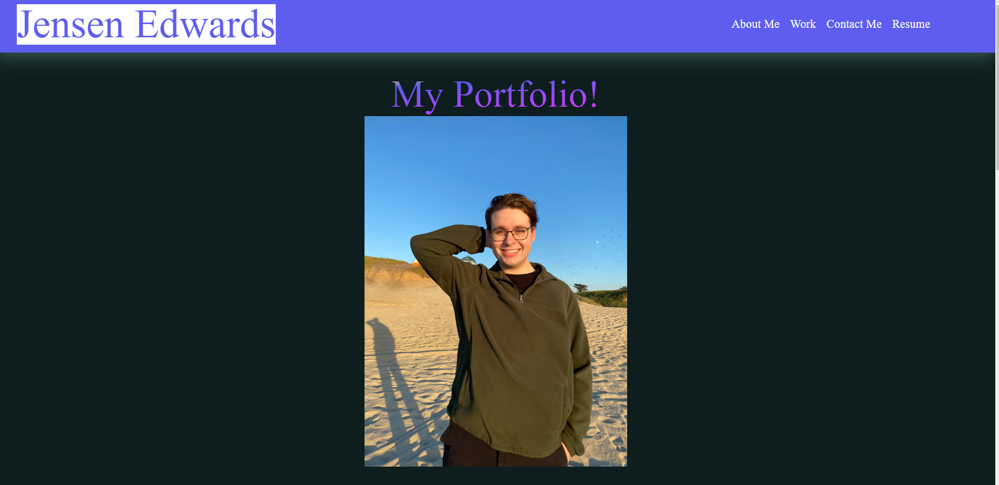

# Professional-Portfolio

## Description

My motivation for this project was to apply my newly learned CSS and HTML skills (especially using flex-box) to make a professional portfolio website with my current acheivements. It helped me learn to implement all I've been learning in one place and work on my problem solving skills when things went wrong or unexpected. I also learned that it takes a lot of checking back on what changes my code made to the live site and adjusting it where i saw fit.

## Installation/Usage

There is no need to install my project as it is just a webpage but to access it simply look under the deployments tab and click on my github page. This is a screenshot of what the page should look like upon accessing.

##License 

MIT License

Copyright (c) 2024 Jensen

Permission is hereby granted, free of charge, to any person obtaining a copy
of this software and associated documentation files (the "Software"), to deal
in the Software without restriction, including without limitation the rights
to use, copy, modify, merge, publish, distribute, sublicense, and/or sell
copies of the Software, and to permit persons to whom the Software is
furnished to do so, subject to the following conditions:

The above copyright notice and this permission notice shall be included in all
copies or substantial portions of the Software.

THE SOFTWARE IS PROVIDED "AS IS", WITHOUT WARRANTY OF ANY KIND, EXPRESS OR
IMPLIED, INCLUDING BUT NOT LIMITED TO THE WARRANTIES OF MERCHANTABILITY,
FITNESS FOR A PARTICULAR PURPOSE AND NONINFRINGEMENT. IN NO EVENT SHALL THE
AUTHORS OR COPYRIGHT HOLDERS BE LIABLE FOR ANY CLAIM, DAMAGES OR OTHER
LIABILITY, WHETHER IN AN ACTION OF CONTRACT, TORT OR OTHERWISE, ARISING FROM,
OUT OF OR IN CONNECTION WITH THE SOFTWARE OR THE USE OR OTHER DEALINGS IN THE
SOFTWARE.
